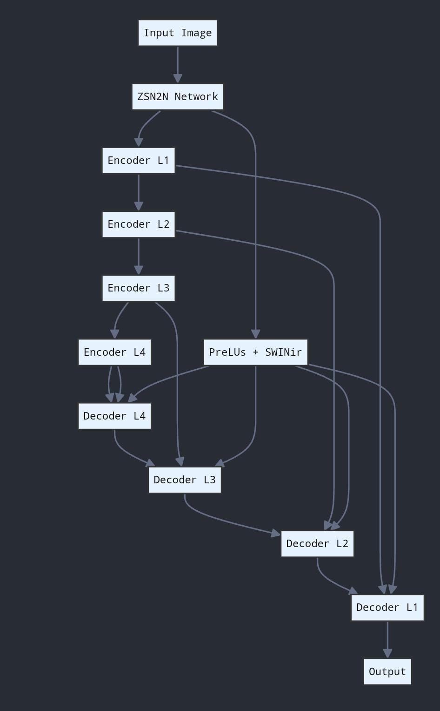
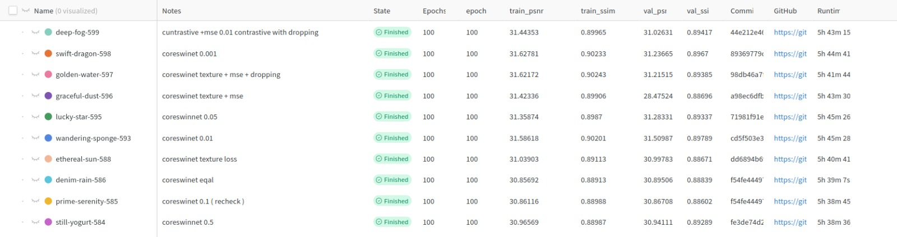
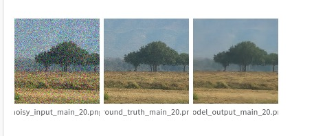
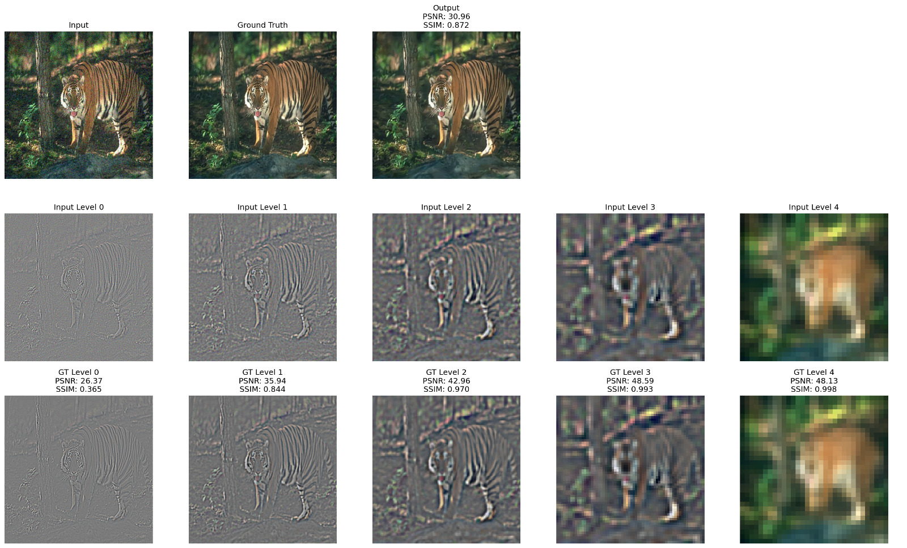
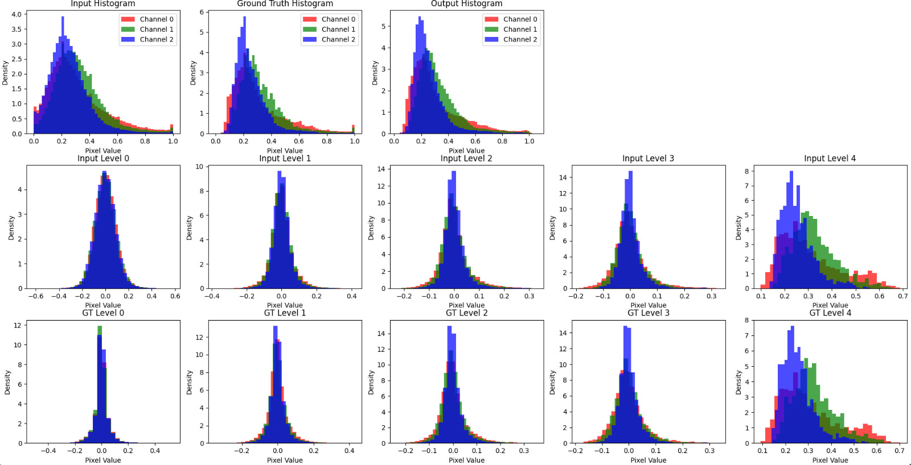
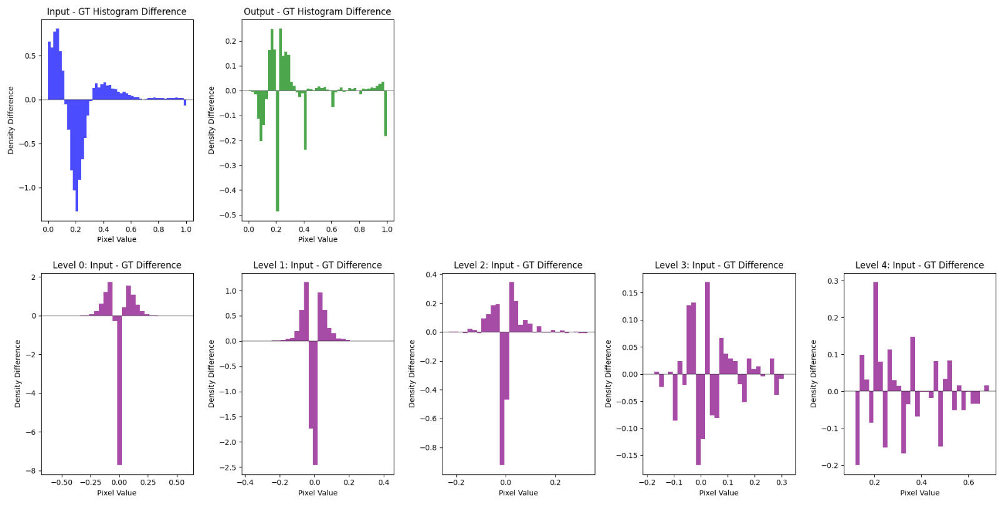

# CoreSwinNet

> **Status: archived research project.** CoreSwinNet was an attempt at a novel denoising architecture. As a research idea it failed: the dual-encoder "prior" design did not deliver the gains we were aiming for.
> As a denoiser, though, it **works well**. It reaches about 31 dB PSNR / 0.89 SSIM on Gaussian noise, and the Swin blocks clearly help overall. It is not state of the art, but it is a solid, usable denoiser.

CoreSwinNet was an experiment in Gaussian image denoising, run from January to February 2025. The idea was to pair a noisy image with a rough "prior" denoised version of the same image, fuse what two encoders learn from them, and use the prior to guide the network toward clean features. Later in training the prior branch would be dropped, so the final model would only need the noisy image.

The repo has many branches, one per experiment. This README describes the `benchmark` branch, where the last round of work happened.

## The idea

```
 noisy image ──► Encoder 1 (ResNet18) ─┐
                                       ├─ max(f1, f2) ─► Swin block (per scale) ─► UNet decoder ─► 1x1 convs ─► tanh ─► denoised
 prior image ──► Encoder 2 (ResNet18) ─┘                       │
                                                  bottleneck ─► Squeeze-Excitation
            contrastive heads on both bottlenecks ─► NT-Xent loss (pull the two views together)
```

1. **Two encoders.** Two ImageNet-pretrained ResNet18 [[7]](#references) UNet [[5]](#references) encoders from `segmentation_models_pytorch`. Encoder 1 sees the noisy image. Encoder 2 sees a pre-denoised prior, which was meant to come from a Zero-Shot Noise2Noise (ZS-N2N) model [[3]](#references), a lightweight descendant of Noise2Noise [[4]](#references).
2. **Fusion at every scale.** The two feature maps are merged with an element-wise `max` at each encoder level. The fused map then goes through a small **Swin Transformer block** (shifted-window self-attention) [[1]](#references) before it is used as a skip connection.
3. **Bottleneck attention.** A Squeeze-and-Excitation block [[8]](#references) re-weights the channels of the deepest fused features.
4. **Contrastive alignment.** Projection heads on the two bottlenecks are trained with the NT-Xent contrastive loss from SimCLR [[9]](#references). The goal was to push the noisy encoder's representation toward the cleaner one.
5. **Bypass phase.** After `bypass_epoch` (20), encoder 2 and the contrastive loss are switched off. Only the noisy input goes through the Swin blocks, with the loss re-weighted toward MSE + PSNR. The hope was that the prior would already be "distilled" into encoder 1 by then.

Training used MSE + a PSNR loss + 0.01 × contrastive loss, with the SOAP optimizer [[10]](#references), and logged to Weights & Biases.

Later branches (`preluruns`, `newmodel`, `levelcon`) changed the wiring. In one variant, the ZS-N2N output feeds the encoder, and a separate PReLU + SwinIR [[2]](#references) path injects features into every decoder level:

<p align="center">
  
</p>

## What the `benchmark` branch contains

This branch was used to compare the full model against simpler baselines:

- `src/utils/model/coreswinet.py` now has a **plain dual-encoder UNet** (`Unet`) with optional `max` fusion and contrastive heads. The Swin/SE variant (`Model`) is still there but **commented out**. Commits on this branch also tried UNet++ [[6]](#references) and concatenation instead of `max` fusion.
- `src/utils/trainer.py` and `src/inference.py` still import `Model`, so **they will not run on this branch as-is**. Uncomment `Model`, or switch the import to `Unet`.

## Results

### Training runs

We swept the contrastive-loss weight (0.001 to 0.5), texture loss, and "dropping" (the bypass phase). Each run trained for 100 epochs, about 5.7 hours. Every run landed at **about 31 dB validation PSNR and 0.89 SSIM**. That is a solid result for a denoiser, though it's not state of the art. The loss and weighting tweaks themselves didn't move the needle much.

<p align="center">
  
</p>

### Sample output

The model does a good job of removing heavy noise while keeping structure and colour intact. Its main weakness is that it slightly smooths the finest texture (grass, foliage):

<p align="center">
  
</p>

### Where the error lives: frequency bands

To see *what* the model was getting wrong, we split the input, ground truth and output into five frequency levels (level 0 = finest detail, level 4 = coarse colour and structure) and compared each level on its own.

<p align="center">
  
</p>

| Level | 0 (finest) | 1 | 2 | 3 | 4 (coarsest) |
|---|---|---|---|---|---|
| PSNR (dB) | 26.37 | 35.94 | 42.96 | 48.59 | 48.13 |
| SSIM | 0.365 | 0.844 | 0.970 | 0.993 | 0.998 |

The coarse levels are reconstructed almost perfectly. Nearly all of the error is in the highest-frequency band, where SSIM falls to 0.37. That band is where the noise sits, and it is also where real texture sits. The model could not tell the two apart.

The histograms show the same thing. The input's high-frequency levels are much wider than the ground truth's, meaning the noise spreads their values out. The output's overall pixel distribution matches the ground truth closely, but the difference plots show sharp spikes around zero at the finest levels. That is the band the model never learned to reconstruct.

<p align="center">
  
</p>

<p align="center">
  
</p>

## What worked

- **It denoises well.** The final model, which needs only the noisy image, reliably removes heavy Gaussian noise and holds about 31 dB PSNR / 0.89 SSIM across runs. It can be used as a general-purpose denoiser.
- **The Swin blocks help.** Adding windowed self-attention on the skip connections improved results overall compared with the variant without Swin (`noswin` branch).

## Why it failed as research

- **It isn't SOTA, and the core idea didn't pay off.** The research bet was the dual-encoder prior and the contrastive alignment, and neither gave a clear boost. The model sits below dedicated transformer restorers like SwinIR [[2]](#references) and Restormer [[11]](#references), so there was no new result to publish.
- **The prior leaked the ground truth.** In the training and validation loops, encoder 2 is given `un_tan_fi(clean)`, which is the *clean target image*, and not a ZS-N2N output (see the commit "untanified gt"). Before the bypass phase, this pushed PSNR to absurd values. Those early numbers say nothing about denoising. Once the model had to work from the noisy image alone, it fell back to the ~31 dB plateau.
- **The finest detail is the weak spot.** As the frequency analysis shows, most of the remaining error is in the highest-frequency band. There, the model sometimes smooths real texture along with the noise.
- **Many unstable variants.** The branches (`conditional`, `condganrun`, `ganruns`, `dual`, `squeeze`, `noswin`, `levelcon`, `loss_experiments`, `cascade_it`, …) tried GAN losses, conditioning, different fusion schemes and loss weightings. None of them beat the main model enough to justify a write-up.

Lessons, for anyone reading this later: check your data flow before trusting a metric jump, benchmark against a plain UNet early, and make sure any "privileged" input is actually available at test time.

## Layout

```
assets/                      # figures used in this README
src/
├── train.py                 # entry point (argparse → trainer)
├── inference.py             # evaluate on CBSD68 / McMaster / Kodak at several noise levels
├── visualizer.py            # sample visualisations
└── utils/
    ├── trainer.py           # training loop, bypass schedule, W&B logging
    ├── dataloader.py        # Waterloo, BSD400, DIV2K, SIDD, CBSD68, McMaster, Kodak
    ├── loss.py              # PSNR, contrastive (NT-Xent), Charbonnier, perceptual, GAN losses
    ├── soap_optimizer.py    # SOAP optimizer
    ├── lr_scheduler.py, misc.py
    └── model/
        ├── coreswinet.py    # model definitions
        └── archs/           # SwinBlocks, AttentionModules (SE, channel attn), Discriminator
```

## Data

The training sets were Waterloo Exploration, BSD400, DIV2K and SIDD. Test sets were CBSD68, McMaster and Kodak. The loaders expect folders of pre-generated noisy images named by noise level, for example `CBSD_noisy_25`, `WaterlooED_noisy_25` and `DIV2K_noisy_25`. The default paths point to Kaggle inputs.

## Running (for reference)

```bash
pip install torch torchvision segmentation-models-pytorch torchmetrics wandb opencv-python albumentations tqdm
cd src
python train.py --train_dir /path/to/Waterloo --dataset_name Waterloo --noise_level 25 --epochs 40 --batch_size 8
```

Weights & Biases logging is on by default. `--wandbd` is parsed as `type=bool`, so passing `False` still turns it on. To turn logging off, change the default in `train.py`.

## References

**Architecture building blocks**

1. Z. Liu et al. **Swin Transformer: Hierarchical Vision Transformer using Shifted Windows.** ICCV 2021. [arXiv:2103.14030](https://arxiv.org/abs/2103.14030)
2. J. Liang et al. **SwinIR: Image Restoration Using Swin Transformer.** ICCV Workshops 2021. [arXiv:2108.10257](https://arxiv.org/abs/2108.10257)

**Denoising priors**

3. Y. Mansour, R. Heckel. **Zero-Shot Noise2Noise: Efficient Image Denoising without any Data.** CVPR 2023. [arXiv:2303.11253](https://arxiv.org/abs/2303.11253)
4. J. Lehtinen et al. **Noise2Noise: Learning Image Restoration without Clean Data.** ICML 2018. [arXiv:1803.04189](https://arxiv.org/abs/1803.04189)

**Backbones and attention**

5. O. Ronneberger, P. Fischer, T. Brox. **U-Net: Convolutional Networks for Biomedical Image Segmentation.** MICCAI 2015. [arXiv:1505.04597](https://arxiv.org/abs/1505.04597)
6. Z. Zhou et al. **UNet++: A Nested U-Net Architecture for Medical Image Segmentation.** DLMIA 2018. [arXiv:1807.10165](https://arxiv.org/abs/1807.10165)
7. K. He et al. **Deep Residual Learning for Image Recognition.** CVPR 2016. [arXiv:1512.03385](https://arxiv.org/abs/1512.03385)
8. J. Hu, L. Shen, G. Sun. **Squeeze-and-Excitation Networks.** CVPR 2018. [arXiv:1709.01507](https://arxiv.org/abs/1709.01507)

**Training**

9. T. Chen et al. **A Simple Framework for Contrastive Learning of Visual Representations (SimCLR).** ICML 2020. [arXiv:2002.05709](https://arxiv.org/abs/2002.05709)
10. N. Vyas et al. **SOAP: Improving and Stabilizing Shampoo using Adam.** 2024. [arXiv:2409.11321](https://arxiv.org/abs/2409.11321)

**Related work (baselines to beat)**

11. S. W. Zamir et al. **Restormer: Efficient Transformer for High-Resolution Image Restoration.** CVPR 2022. [arXiv:2111.09881](https://arxiv.org/abs/2111.09881)
12. K. Zhang et al. **Beyond a Gaussian Denoiser: Residual Learning of Deep CNN for Image Denoising (DnCNN).** IEEE TIP 2017. [arXiv:1608.03981](https://arxiv.org/abs/1608.03981)
13. L. Chen et al. **Simple Baselines for Image Restoration (NAFNet).** ECCV 2022. [arXiv:2204.04676](https://arxiv.org/abs/2204.04676)

## Contributors

- [@aravinthakshan](https://github.com/aravinthakshan)
- [@aryamangupta04](https://github.com/aryamangupta04)
- [@aravindshenoy13](https://github.com/aravindshenoy13)
